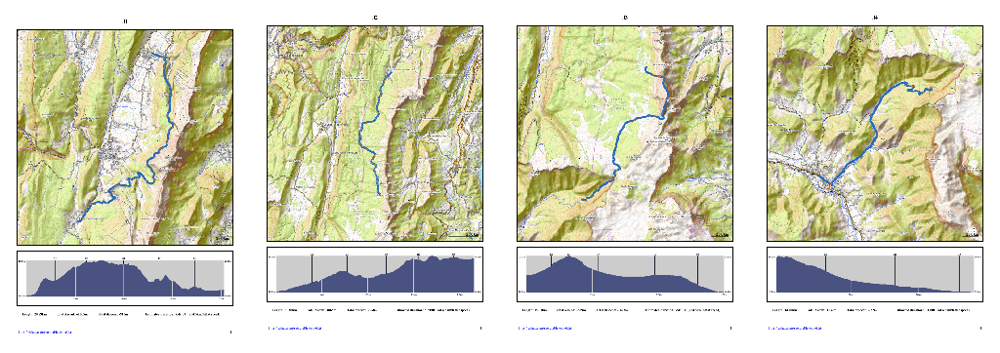

# Hike Booklet
A python script generating a hiking booklets (HTML or PDF) from a planned GPX routes.

## Features
* **Elevation:** waypoint elevation estimation using the [USGS](https://www.usgs.gov/faqs/what-types-elevation-datasets-are-available-what-formats-do-they-come-and-where-can-i-download?qt-news_science_products=0#qt-news_science_products) Digital Elevation Model (DEM)
* **Walking time:**  hiking times estimation based on waypoint distances and elevations analysis using the [Tobler](https://en.wikipedia.org/wiki/Tobler%27s_hiking_function) hiking function
* **Profile:** elevation profile according to distance and time
* **Map:** map generation using [OpenTopoMap](https://opentopomap.org) tiles with GPX track plot

## Quick Start
1. Before generating a hike booklet, an Earthdata (NASA) account must be created in order to access the DEM server. Register at https://urs.earthdata.nasa.gov/profile
2.  Modify if necessary, the settings in config.py; especially:
    * FLAT_SPEED (default: 4.5km/h)
    * CACHE_PATH (default:  '~/.cache/hikebooklet').
3. Execute the script using the gpx route example (replace XXXXX:YYYY by earthdata authentication username:password)
```
python ./main.py -v -a XXXXX:YYYYY -i ./examples/test.gpx ./examples/rsl
```
4.  You can now browse and print the hike booklet by opening the file 'examples/rsl/index.html'

## Usage
```
python ./main.py [-h] [-v] [-s speed] [-a username:password] -i input_gpx_file output_dir
optional arguments:
    -h, --help               show this help message and exit
    -v,                      print information messages to stderr (-vv for debugging)
    -s speed,                flat speed (default to 4,5km/h)
    -a username:password,    authentication information for the DEM server
    -i input_gpx_file,       input gpx file
positional arguments:
    output_dir               directory path where resulting data will be stored
```

## How to create GPX route
Several free softwares are available to create a GPX route and among them:
- [Viking](https://sourceforge.net/projects/viking/)
- [GPX Editor](https://sourceforge.net/projects/gpxeditor/)

There is also interesting online tools such as:
* [WTracks](https://opoto.github.io/wtracks/)
* [wandermap](http://www.wandermap.net/)

GPX route waypoints are decimal degrees on a Web Mercator Projection (WGS 84 Web Mercator).